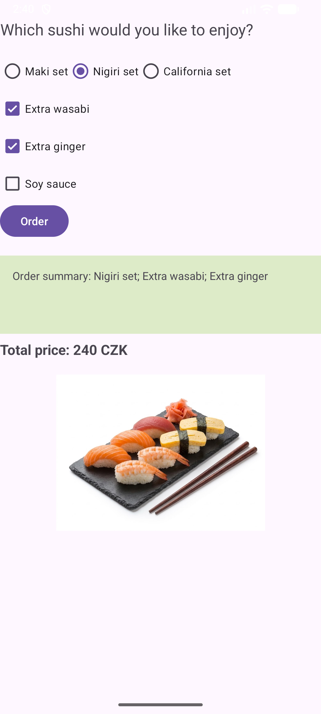
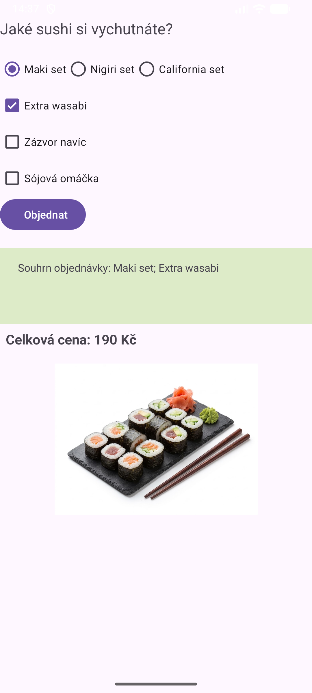
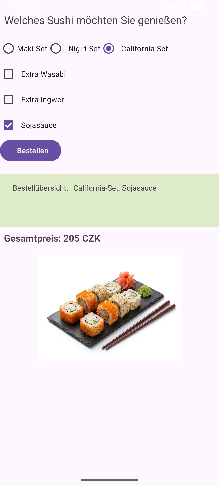

# Objednávka sushi (MyApp004Objednavka)

Jednoduchá Android aplikace v Kotlinu pro objednávku sushi.

## Funkce

- výběr druhu sushi (Maki, Nigiri, California), obrázek se mění podle výběru
- doplňky navíc: wasabi, zázvor, sójová omáčka
- souhrn objednávky po stisku tlačítka
- **výpočet celkové ceny objednávky** (cena setu + příplatky za doplňky)
- lokalizace: angličtina (výchozí), čeština, němčina

## Ceny

| Položka | Cena |
|---|---|
| Maki set | 180 Kč |
| Nigiri set | 220 Kč |
| California set | 200 Kč |
| Extra wasabi | +10 Kč |
| Zázvor navíc | +10 Kč |
| Sójová omáčka | +5 Kč |

## Lokalizace

Všechny texty jsou ve `strings.xml`, žádné natvrdo v kódu ani v layoutu.

| Jazyk | Složka |
|---|---|
| English (výchozí) | `res/values/` |
| Čeština | `res/values-cs/` |
| Deutsch | `res/values-de-rDE/` |

Pro jiný jazyk zařízení se použije angličtina.

## Screenshoty

| English | Čeština | Deutsch |
|---|---|---|
|  |  |  |

